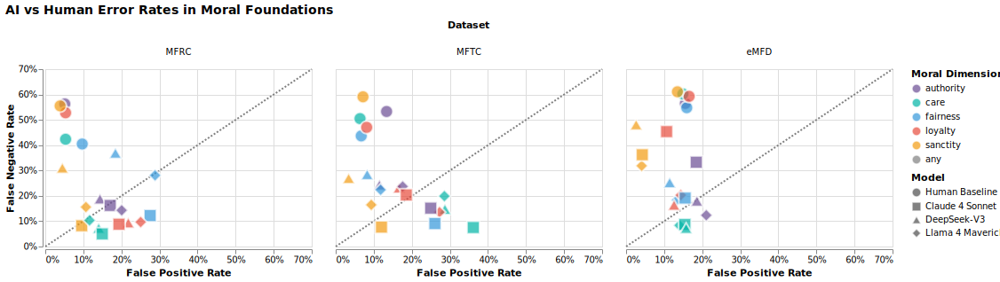

# Estimating Human vs AI Moral Competences

[](https://python.org)
[](https://jupyter.org)
[](https://tensorflow.org)
[](https://huggingface.co/datasets/maciejskorski)
[](https://wandb.ai)
[](https://www.gnu.org/licenses/old-licenses/gpl-2.0.en.html)
[](https://maciejskorski.github.io/moral-foundations-llm-eval/)
[](https://arxiv.org/abs/2508.13804)

## 📋 Overview

Large-scale comprehensive evaluation of LLMs on moral foundation classification using Haidt's Moral Foundations Theory and Bayesian statistical modeling accelerated with GPU. This project systematically compares AI performance against human annotators across moral dimensions.

**🎯 Key findings:** AI models show more balanced predictions and much fewer false negatives (missed findings) compared to human annotators, achieving 75th-100th percentile performance across moral foundations.

AI vs Human Performance


AI vs Human Errors



## 🗂️ Project Structure

### [`datasets.ipynb`](src/datasets.ipynb)
**📊 Dataset Standardization** 

Standardizes MFRC (Reddit), MFTC (Twitter), and eMFD datasets into unified 5-foundation taxonomy. Handles deduplication, multi-annotator formats, and convert clean datasets to the 🤗 HuggingFace format.

### [`ask_llm.ipynb`](src/ask_llm.ipynb)
**🤖 LLM Evaluation Pipeline**

Evaluates multiple LLMs (Claude-4, DeepSeek-V3, Llama4-Maverick, etc.) on moral foundation classification with:
- Async processing for efficient batch inference
- Standardized prompting across models
- Performance logging to Weights & Biases
- Error handling and result validation

**Usage with Papermill:**
```bash
papermill ask_llm.ipynb output.ipynb -p model_name "claude-4-sonnet" -p test_data 'morality-MFRC' -p sample 100 -p temperature 0.3 --log-output
```

### [`annots_competences.ipynb`](src/annots_competences.ipynb)
**📈 Human vs AI Performance Analysis**

Implements a novel GPU-efficient Dawid-Skene competence model in TensorFlow to:
- Estimate annotator competence and consensus
- Compare AI performance against human baselines
- Generate percentile rankings and balanced accuracy metrics
- Visualize performance distributions across moral dimensions and datasets


## ⚙️ Dependencies

- `datasets`, `transformers` for data handling
- `anthropic`, `openai`, `replicate` for LLM APIs
- `tensorflow`, `tensorflow-probability` for competence modeling
- `wandb` for experiment tracking
- `papermill` for parameterized execution
